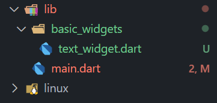
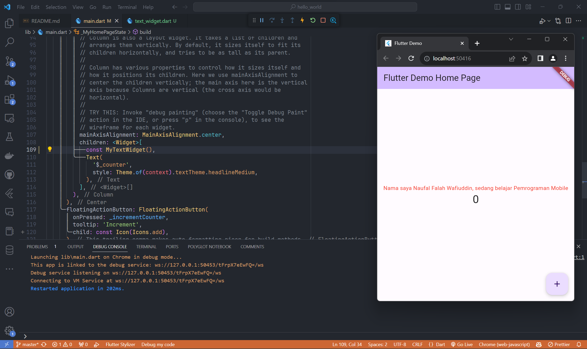
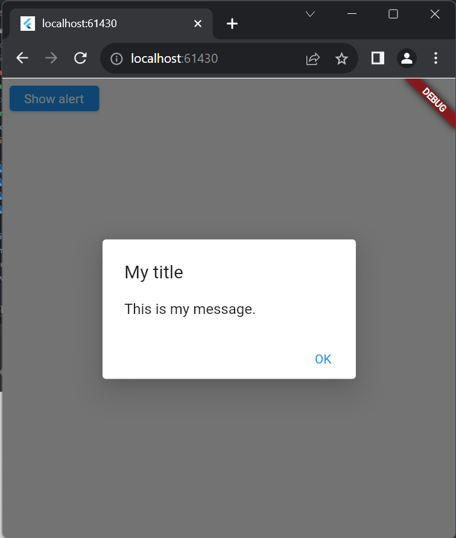
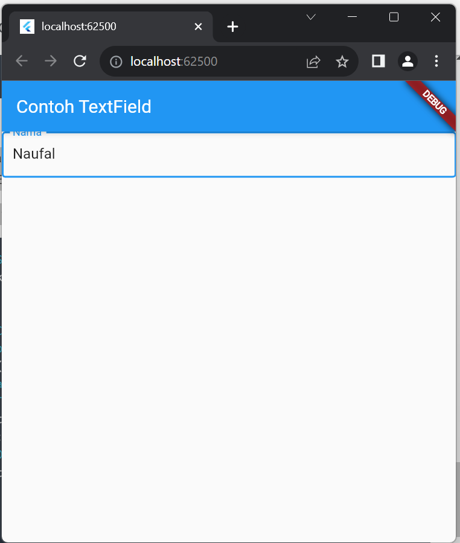

# Flutter Fundamental

---

## Praktikum 3: Menerapkan Widget Dasar

#### Langkah 1: Text Widget

- Buat folder baru basic_widgets di dalam folder lib. Kemudian buat file baru di dalam basic_widgets dengan nama text_widget.dart

- Ketik atau salin kode program berikut ke project hello_world Anda pada file text_widget.dart

- Lakukan import file text_widget.dart ke main.dart, lalu ganti bagian text widget dengan kode di atas

#### Langkah 2: Image Widget

- Buat sebuah file image_widget.dart di dalam folder basic_widgets dengan isi kode berikut.

- Lakukan penyesuaian asset pada file pubspec.yaml dan tambahkan file logo Anda di folder assets project hello_world.

- Jangan lupa sesuaikan kode dan import di file main.dart kemudian akan tampil gambar seperti berikut.

## Praktikum 4: Menerapkan Widget Dasar

#### Langkah 1: Cupertino Button dan Loading Bar

- Buat file di basic_widgets > loading_cupertino.dart. Import stateless widget dari material dan cupertino. Lalu isi kode di dalam method Widget build adalah sebagai berikut.

- Output:
  

#### Langkah 2: Floating Action Button (FAB)

Button widget terdapat beberapa macam pada flutter yaitu ButtonBar, DropdownButton, TextButton, FloatingActionButton, IconButton, OutlineButton, PopupMenuButton, dan ElevatedButton.

- Buat file di basic_widgets > fab_widget.dart. Import stateless widget dari material. Lalu isi kode di dalam method Widget build adalah sebagai berikut.

#### Langkah 2: Floating Action Button (FAB)

Button widget terdapat beberapa macam pada flutter yaitu ButtonBar, DropdownButton, TextButton, FloatingActionButton, IconButton, OutlineButton, PopupMenuButton, dan ElevatedButton.

- Buat file di basic_widgets > fab_widget.dart. Import stateless widget dari material. Lalu isi kode di dalam method Widget build adalah sebagai berikut.

- Output:
  

#### Langkah 3: Scaffold Widget

Scaffold widget digunakan untuk mengatur tata letak sesuai dengan material design.

- Ubah isi kode main.dart seperti berikut.
  

#### Langkah 4: Dialog Widget

Dialog widget pada flutter memiliki dua jenis dialog yaitu AlertDialog dan SimpleDialog.

- Ubah isi kode main.dart seperti berikut.

- Output:
  

#### Langkah 5: Input and Selection Widget

Flutter menyediakan widget yang dapat menerima input dari pengguna aplikasi yaitu antara lain Checkbox, Date and Time Pickers, Radio Button, Slider, Switch, TextField.

- Contoh penggunaan TextField widget adalah sebagai berikut:

- Output:
  

#### Langkah 6: Date and Time Pickers

Date and Time Pickers termasuk pada kategori input dan selection widget, berikut adalah contoh penggunaan Date and Time Pickers.

- Contoh penggunaan Date and Time Pickers widget adalah sebagai berikut:

- Output:
  
